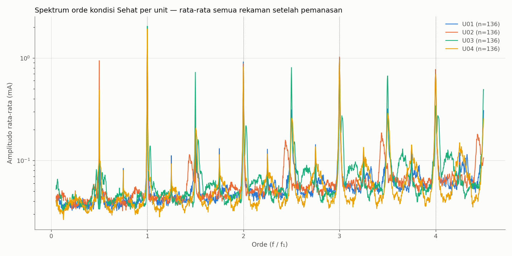
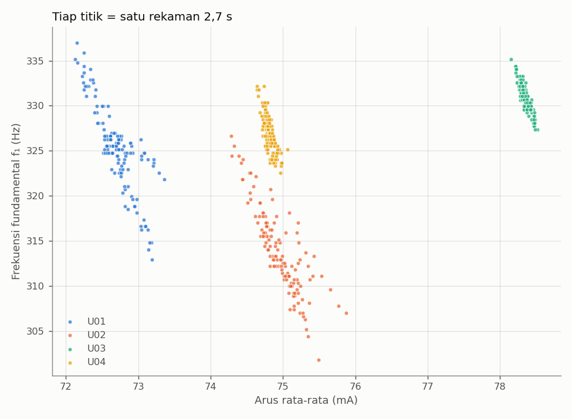

# Analisis Gerbang Kelayakan — Langkah 1: Sebaran Antar Unit pada Kondisi Sehat

*Tanggal: 06-10-2026 · Data: sesi s4, unit U01–U04 · Skrip: `tools/overlay_orde.py`*

## 1. Tujuan

Sebelum melatih model, perlu dipastikan bahwa perbedaan **antar unit kipas sehat** cukup kecil dibanding perubahan yang ditimbulkan gangguan. Bila kipas-kipas sehat yang identik sudah berbeda jauh satu sama lain, gangguan kecil (mis. massa 33 mg) akan tenggelam dalam sebaran tersebut. Langkah 1 mengukur sebaran itu; langkah 2 (massa 100 mg) akan membandingkannya dengan efek gangguan melalui *effect size* Cohen's *d*.

## 2. Data dan metode

| Unit | Keterangan | Rekaman dianalisis |
|---|---|---|
| U01 | sudah beberapa kali dioperasikan | 136 |
| U02 | sudah beberapa kali dioperasikan | 136 |
| U03 | baru; inreyen 30 menit sebelum direkam | 150 |
| U04 | baru; inreyen 30 menit sebelum direkam | 150 |

- Setiap rekaman: 8192 sampel arus pada 3030 SPS (±2,7 s), kipas pada 12,72 V tanpa PWM, dudukan terstandar, kipas angin ruangan mati.
- Rekaman 60 detik pertama U01/U02 dibuang (fase pemanasan).
- Tiap rekaman diubah menjadi spektrum amplitudo (jendela Hann). Frekuensi fundamental **f₁** ditentukan sebagai puncak terkuat di pita 200–400 Hz.
- Sumbu frekuensi dinormalisasi menjadi **orde** (f / f₁), lalu spektrum dirata-rata per unit. Normalisasi ini menghilangkan pengaruh perbedaan kecepatan putar, sehingga spektrum antar unit dan antar rekaman dapat dibandingkan langsung (*order tracking*).
- Hanya komponen di bawah frekuensi Nyquist (1515 Hz, ≈ orde 4,5) yang dipakai.

## 3. Hasil

### 3.1 Spektrum orde

**Pengamatan:**

1. **Orde bulat (1, 2, 3, 4 × f₁) hampir identik antar unit.** Ini adalah komponen riak utama hasil komutasi motor.
2. **Terdapat puncak-puncak kecil di setiap kelipatan ¼ f₁** (0,5; 0,75; 1,25; 1,75; 2,25; 2,75; …). Komponen seperti ini hanya muncul bila ada periodisitas yang lebih lambat dari f₁, yaitu **putaran rotor itu sendiri**. Artinya f₁ = 4 × frekuensi putaran (4 komutasi per putaran, umum pada motor kipas 4 kutub), sehingga:

   | Unit | f₁ (Hz) | Frekuensi putaran f₁/4 (Hz) | Kecepatan (RPM) |
   |---|---|---|---|
   | U01 | 325,3 | 81,3 | ≈ 4.880 |
   | U02 | 313,9 | 78,5 | ≈ 4.710 |
   | U03 | 331,0 | 82,8 | ≈ 4.970 |
   | U04 | 326,9 | 81,7 | ≈ 4.900 |

   Kecepatan ini sesuai rentang kipas 50 mm 12 V (3.500–5.500 RPM). Status: **didukung data, belum dikonfirmasi** dengan stroboskop atau uji massa.
3. Puncak di sekitar orde 1,45; 2,45; 3,45 adalah komponen ***alias*** (harmonik di atas Nyquist yang terlipat). Komponen ini bergerak berlawanan arah bila kecepatan berubah, sehingga tidak boleh dipakai sebagai ciri orde.

### 3.2 Kecepatan vs arus per rekaman

**Pengamatan:**

1. **Di dalam satu unit**, kecepatan berfluktuasi ±0,5–1,5 % dan selalu berbanding terbalik dengan arus (korelasi r ≈ −0,84 s.d. −0,88): saat beban mekanis sesaat naik, putaran turun dan arus naik. Fluktuasi ini tetap ada walaupun aliran udara ruangan dihilangkan, jadi merupakan sifat bawaan kipas.
2. **Antar unit**, keempat kipas terpisah sempurna pada sumbu arus (72,7 / 75,0 / 78,3 / 74,8 mA). Kipas baru (U03, U04) lebih stabil (±0,5 %) daripada kipas yang sudah lebih lama dipakai (U01, U02; ±1,5 %). Penyebab perbedaan ini belum diketahui.

### 3.3 Sebaran ciri antar unit

| Ciri | U01 | U02 | U03 | U04 | σ antar-unit | σ dalam-unit |
|---|---|---|---|---|---|---|
| f₁ (Hz) | 325,3 | 313,9 | 331,0 | 326,9 | 7,3 | 3,2 |
| Arus rata-rata (mA) | 72,70 | 74,96 | 78,34 | 74,82 | **2,33** | 0,17 |
| Riak RMS / DC (%) | 6,02 | 5,97 | 5,88 | 5,92 | 0,06 | 0,05 |
| Amplitudo orde ¼ — **1× putaran** (mA) | 0,077 | 0,076 | 0,090 | 0,085 | **0,007** | ≈ 0,02 |
| Amplitudo orde ½ (mA) | 0,29 | 0,98 | 0,21 | 0,52 | 0,35 | ≈ 0,09 |
| Amplitudo orde 1½ (mA) | 0,38 | 0,22 | 0,80 | 0,41 | 0,25 | ≈ 0,15 |
| Amplitudo orde 1 (mA) | 1,85 | 1,85 | 2,05 | 1,92 | 0,09 | 0,37 |

Lantai derau spektrum: 41–48 µA.

## 4. Interpretasi

**a. Kabar baik untuk kelas Tidak Seimbang.** Massa tambahan pada bilah menimbulkan gaya sentrifugal yang berputar satu kali per putaran, sehingga tanda tangannya berada tepat di **orde ¼ f₁ (1× putaran)**. Pada kondisi Sehat, amplitudo di orde ini rendah (≈ 2× lantai derau) dan **sangat seragam antar unit** (σ antar-unit hanya 0,007 mA). Dengan garis dasar seperti ini, kenaikan kecil pun berpotensi menghasilkan *effect size* yang besar. Hal ini baru dapat dibuktikan setelah langkah 2 (massa 100 mg).

**b. Risiko sidik jari unit.** Arus rata-rata, orde ½, dan orde 1½ jauh lebih bervariasi antar unit daripada di dalam satu unit. Ciri semacam ini memungkinkan model "menghafal" unit kipas alih-alih mengenali kondisinya. Konsekuensinya:
- Validasi **leave-one-unit-out** wajib dipakai untuk mengukur kemampuan generalisasi yang sebenarnya.
- Ciri yang stabil antar unit (rasio riak/DC, orde ¼, orde bulat) perlu diutamakan; ciri yang sangat bergantung unit perlu diuji pengaruhnya terhadap hasil LOUO.

**c. Dukungan untuk *order tracking*.** Kecepatan kipas sehat sendiri bergeser hingga ±5 Hz antar rekaman dan ±17 Hz antar unit. Ciri berbasis frekuensi absolut (Hz) tidak akan konsisten, sedangkan ciri berbasis orde tetap sejajar (Gambar 3.1).

## 5. Keterbatasan dan langkah selanjutnya

- Baru 4 dari 6–8 unit yang ditargetkan; U05–U10 belum direkam.
- Semua rekaman pada tegangan penuh (tanpa PWM). Data Sehat pada sapuan PWM 40–100 % harus dikumpulkan **sebelum** perlakuan permanen (massa) diterapkan.
- Interpretasi f₁ = 4 × putaran belum dikonfirmasi secara independen.
- Langkah 2: pasang massa 100 mg pada satu unit jalur A, rekam, lalu hitung Cohen's *d* = |μ_gangguan − μ_sehat| / σ_antar-unit-sehat untuk tiap ciri. Lulus bila beberapa ciri memiliki *d* > 2.
